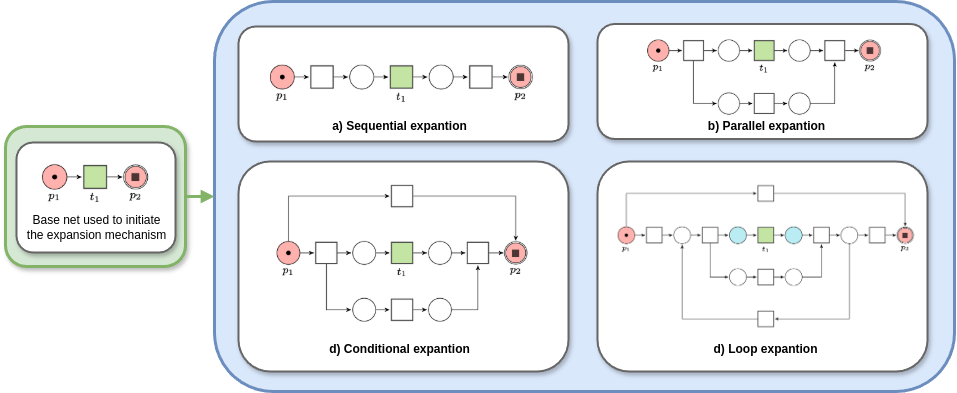
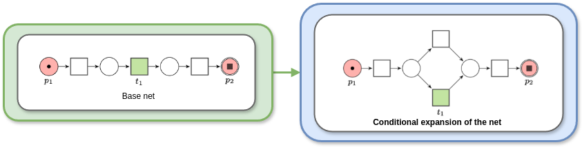

# Spe3llsWizard: From Sound Workflow Nets to LTLf Declarative Specifications by Casting Three Spells

This repository contains the implementation and experimental toolbench presented in the paper “From Sound Workflow Nets to LTLf Declarative Specifications by Casting Three Spells". This work introduces a systematic approach to synthesize declarative process specifications from safe and sound Workflow nets, ensuring that the original behavior is fully preserved. Here, you'll find the complete toolchain and experimental setups, tested on both synthetic and real-world datasets, analyzing the correctness and performance of our implemented algorithm. 

## Overview
Sp3llsWizard is an approach designed to formally synthesize DECLARE specifications from sound Workflow nets. The proof-of-concept implememtation automatically generates LTLf constraints from an input Workflow net in the form of a .pnml file.

## Repository

The main content of the repository is structured as follows:
-  [/src/](https://github.com/l2brb/Sp3llsWizard/tree/main/src): the root folder of the implementation source code
    -  [/src/declare-translator](https://github.com/l2brb/Sp3llsWizard/tree/main/src/declare-translator): contains the algorithm's implementation
-  [/evaluation/](https://github.com/l2brb/Sp3llsWizard/tree/main/evaluation): folder containing datasets and results of our tests
    - [/evaluation/bisimualtion/](https://github.com/l2brb/Sp3llsWizard/tree/main/evaluation/bisimulation) contains the convergence test data 
    - [/evaluation/setcardinality/](https://github.com/l2brb/Sp3llsWizard/tree/main/evaluation/d_contraints) includes the memory usage tests data 
    - [/evaluation/formulasize/](https://github.com/l2brb/Sp3llsWizard/tree/main/evaluation/n_constraints) contains the data of the scalability tests
    - [/evaluation/realworld/](https://github.com/l2brb/Sp3llsWizard/tree/main/evaluation/realworld) contains the data of the scalability tests
-  [/diagnostics/](https://github.com/l2brb/Sp3llsWizard/tree/main/evaluation/conformance): folder containing datasets and results of our tests

## Setup and run
As a requirement, python 3.13.0 at least should be installed on your machine. To launch the .sh test files, you have to run them on a Unix-based system with a BASH shell. No installation procedure is required. This version has been tested on both a Ubuntu Linux (24.04.1) and a Mac OS X machine.

```
python3 main.py -iWN file/path.pnml -oJSON file/path.json
```


## Evaluation
We evaluated our algorithm on a range of both synthetic and real-world data. For the real-world testbed, we take as input processes discovered by a well-known imperative process mining algorithm from a collection of openly available event logs. We conducted the performance tests on an AMD Ryzen 9 8945HS CPU at 4.00 GHz with 32 GB RAM running Ubuntu 24.04.1. 


#### Bisimulation

To experimentally validate the correctness of our approach in the transmission and computation phases, we run a [bisimualtion](https://github.com/l2brb/Sp3llsWizard/tree/main/evaluation/bisimulation) test. To this end, we . We run the stand-alone MINERful... . The convergence results are available in [/output/](https://github.com/l2brb/Sp3llsWizard/tree/main/evaluation/bisimulation) in the form of a workflow net.

### Performance analysis

To evaluate the runtime memory utilization of our Sp3llsWizard implementation, we run a [performance](https://github.com/l2brb/Sp3llsWizard/tree/main/evaluation/d_contraints) test, split into two different configurations.


#### Increasing constraint-set cardinality.

The evaluation method relies on an expansion mechanism that iteratively applies a structured pattern of four soundness-preserving transformation rules to progressively increase the number of nodes and their configuration. This leads to a gradual increase in the number of constraints our algorithm needs to initiate. 





#### Increasing constraint formula size

Here, we configure the test on memory usage and execution time to investigate the algorithm’s performance while handling an expanding constraints’ formula size (i.e., with an increasing number of disjuncts). To this end, we progressively broaden the Workflow net by applying the soundness-preserving conditional
expansion rule. 




#### Real-world process model testing 

To evaluate the performance of our algorithm on real process models, we run memory usage and execution time tests on workflow nets derived from real-world event logs. First, we generate workflow nets by applying the Inductive Miner algorithm, available in pm4py.

```
python3 miner.py
```


We run our algorithm on the generated workflow nets to derive the corresponding Declare specification in JSON format. The scripts record memory usage (in MB) and execution time (in ms) during processing.

| **Event log** | **Trans.** | **Places** | **Nodes** | **Mem.usage [MB]** | **Exec.time [ms]** |
|---------------|-----------:|-----------:|----------:|-------------------:|-------------------:|
| [BPIC 12](https://doi.org/10.4121/UUID:3926DB30-F712-4394-AEBC-75976070E91F) | 78 | 54 | 174 | 19.97 | 5.11 |
| [BPIC 13<sub>cp</sub>](https://doi.org/10.4121/UUID:C2C3B154-AB26-4B31-A0E8-8F2350DDAC11) | 19 | 54 | 44 | 19.76 | 1.70 |
| [BPIC 13<sub>inc</sub>](https://doi.org/10.4121/UUID:500573E6-ACCC-4B0C-9576-AA5468B10CEE) | 23 | 17 | 50 | 19.89 | 2.03 |
| [BPIC 14<sub>f</sub>](https://doi.org/10.4121/UUID:3CFA2260-F5C5-44BE-AFE1-B70D35288D6D) | 46 | 35 | 102 | 19.90 | 3.31 |
| [BPIC 15<sub>1f</sub>](https://doi.org/10.4121/UUID:A0ADDFDA-2044-4541-A450-FDCC9FE16D17) | 135 | 89 | 286 | 20.44 | 8.39 |
| [BPIC 15<sub>2f</sub>](https://doi.org/10.4121/UUID:63A8435A-077D-4ECE-97CD-2C76D394D99C) | 200 | 123 | 422 | 20.91 | 12.30 |
| [BPIC 15<sub>3f</sub>](https://doi.org/uuid:ed445cdd-27d5-4d77-a1f7-59fe7360cfbe) | 178 | 122 | 396 | 20.77 | 11.49 |
| [BPIC 15<sub>4f</sub>](https://doi.org/uuid:679b11cf-47cd-459e-a6de-9ca614e25985) | 168 | 115 | 368 | 20.55 | 11.38 |
| [BPIC 15<sub>5f</sub>](https://doi.org/uuid:b32c6fe5-f212-4286-9774-58dd53511cf8) | 150 | 99 | 320 | 20.43 | 9.16 |
| [BPIC 17](https://doi.org/10.4121/UUID:5F3067DF-F10B-45DA-B98B-86AE4C7A310B) | 87 | 55 | 184 | 19.91 | 5.67 |
| [RTFMP](https://doi.org/10.4121/UUID:270FD440-1057-4FB9-89A9-B699B47990F5) | 34 | 29 | 82 | 19.81 | 3.47 |
| [Sepsis](https://doi.org/10.4121/UUID:915D2BFB-7E84-49AD-A286-DC35F063A460) | 50 | 39 | 116 | 19.75 | 3.65 |


### Process Diagnostics


