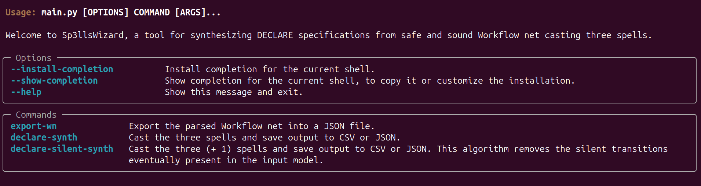
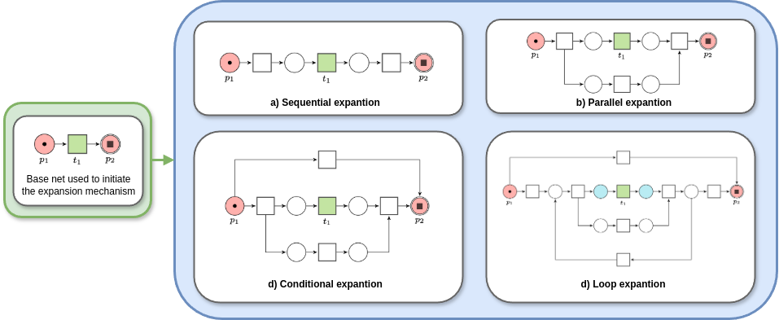
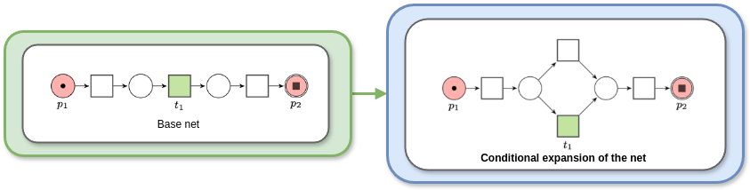

[](https://arxiv.org/abs/2504.05114)


## Sp3llsWizard: From Sound Workflow Nets to LTLf Declarative Specifications by Casting Three Spells

This repository contains the implementation and experimental toolbench presented in the paper “From Sound Workflow Nets to LTLf Declarative Specifications by Casting Three Spells". The work presents a systematic approach to synthesizing declarative process specifications from safe and sound Workflow Nets (WF nets), ensuring full behavioral preservation. Here you’ll find the complete toolchain and experimental setup, tested on both synthetic and real-world datasets, used to analyze the correctness and performance of the implemented algorithm.

## Publications and further material
For more information about the Sp3llsWizard approach and toolkit, consult the following publications:
- Luca Barbaro, Giovanni Varricchione, Marco Montali, Claudio Di Ciccio (2025) From Sound Workflow Nets to LTLf Declarative Specifications by Casting Three Spells. In: BPM Forum 2025, Springer.
  - Paper (DOI): [10.1007/978-3-032-02929-4_1](https://doi.org/10.1007/978-3-032-02929-4_1)
  - Paper (ePrint): [arxiv.org/abs/2504.05114](https://arxiv.org/abs/2504.05114) 
  - Presentation: [slideshare.net/slideshow/from-sound-workflow-nets-to-ltlf-declarative-specifications-7dab/285115645](https://www.slideshare.net/slideshow/from-sound-workflow-nets-to-ltlf-declarative-specifications-7dab/285115645)

## Overview
**Sp3llsWizard** has the ability to formally synthesize **DECLARE** specifications from safe and sound **Workflow Nets**. This proof-of-concept implementation automatically generates LTLf constraints from an input WF net provided as a `.pnml` file.

The stable `main` branch always synthesizes constraints over **transition IDs**.
The synthesis alphabet is the transition set `T`: two transitions with the same
display name remain distinct during synthesis. Select `--symbols ids`
to export those IDs, or `--symbols labels` (default) to substitute names after synthesis.
Both exports include `transitionsMap` (label → list of transition IDs) for
subsequent refinement. All transitions participate in synthesis, including
invisible PNML transitions. Neither export performs silent-transition closure
or hides transitions.

The original three rules are preserved: `Atmost1` over the source place's
postset, `End` over the sink place's preset, and one branched
`AlternatePrecedence(preset, postset)` for each internal place. Safety and
soundness are required; the parser validates structure and boundary markings,
but does not prove these semantic properties.

The `dev` branch preserves the experimental silent translators,
label-based conformance/alignment, alternative implementations and scratch
outputs. Those experiments are not part of the stable CLI. See
[the core review and branch inventory](docs/REVISIONE_CORE.md).


## Quickstart

Python 3.11 or later:

```bash
git clone https://github.com/l2brb/Sp3llsWizard.git
cd Sp3llsWizard
python3 -m venv .venv
source .venv/bin/activate
python -m pip install -r requirements.txt
mkdir -p output
python main.py declare-synth --pnml-file examples/sequence.pnml --output-path output/sequence.json
python main.py export-wn --pnml-file examples/sequence.pnml --output-path output/net.json
```

Alternatively, create the minimal Conda environment:

```bash
conda env create -f environment.yml
conda activate sp3lls-env
```

`examples/sequence.pnml` has two transitions named `Approve`, with distinct IDs
`t1` and `t2`. The default label output has alphabet `["Approve"]`. With
`--symbols ids`, the alphabet is `["t1", "t2"]` and the only complete run is
`["t1", "t2"]`. JSON contains `name`, `tasks`,
`constraints` and `transitionsMap`. `--output-format csv` retains the legacy
two-column model-summary export, including the mapping; JSON is the
specification format.

### Choose transition IDs or labels

```bash
# Transition IDs (explicit opt-in)
python main.py declare-synth --pnml-file examples/sequence.pnml --symbols ids --output-path output/sequence-ids.json

# Labels (default when --symbols is omitted), substituted after synthesis
python main.py declare-synth --pnml-file examples/sequence.pnml --symbols labels --output-path output/sequence-labels.json
```

The option works with both `--output-format json` and `--output-format csv`.
In label mode, `tasks` and every constraint parameter use the PNML names;
repeated labels are listed once within each set. Constraints and their groups
are retained, even when a label appears on both sides. Missing or blank names
fall back to the transition ID. In both modes, the example's mapping is:

```json
"transitionsMap": {"Approve": ["t1", "t2"]}
```

The behavioral-equivalence guarantee concerns the ID-based specification.
With unique labels, label export is a renaming. With duplicate labels, this
post-processing is a label substitution, not a general language-preserving
projection: it can change the accepted behavior. For example, the two
sequential `Approve` transitions become `Atmost1(Approve)` and
`AlternatePrecedence(Approve, Approve)`. Keep ID output for behavioral analysis
and use the mapping for further refinement.

Only `declare-synth` and `export-wn` are supported on `main`. Input errors and
invalid output formats return a nonzero exit status.

Run the regression suite:

```bash
python -m unittest discover -s tests -v
```

The suite explores the full reachable product of the Petri-net marking
automaton and independent DECLARE monitors on small fixtures, including loops.
This checks complete-language equivalence on those fixtures without a trace
length cutoff. It does not constitute a new proof for arbitrary input nets.

## Repository

The main content of the repository is structured as follows:
-  [/src/](https://github.com/l2brb/Sp3llsWizard/tree/main/src): the root folder of the implementation source code
    -  [/src/declare_translator](https://github.com/l2brb/Sp3llsWizard/tree/main/src/declare_translator): contains the algorithm's implementation
-  [/evaluation/](https://github.com/l2brb/Sp3llsWizard/tree/main/evaluation): folder containing code, datasets and results of our tests
    - [/evaluation/bisimulation/](https://github.com/l2brb/Sp3llsWizard/tree/main/evaluation/bisimulation) contains the bisimulation test data 
    - [/evaluation/set_cardinality/](https://github.com/l2brb/Sp3llsWizard/tree/main/evaluation/performance/set_cardinality) includes test data on memory usage and execution time as the cardinality of the constraint set varies.
    - [/evaluation/formula_size/](https://github.com/l2brb/Sp3llsWizard/tree/main/evaluation/performance/formula_size) includes test data on memory usage and execution time under varying constraints formula size
    - [/evaluation/realworld/](https://github.com/l2brb/Sp3llsWizard/tree/main/evaluation/performance/realworld) includes the memory usage and execution time tests data for real-world process models
-  [/evaluation/diagnostics/](https://github.com/l2brb/Sp3llsWizard/tree/main/evaluation/diagnostics): folder containing a downstream application of our algorithm for process diagnostics

### Setup & Execution

- Minimum supported Python: **3.11**.
- Tested on:
  - Ubuntu Linux 24.04.1
  - macOS
  - Windows 11 (via WSL or Unix-like shell)
- No installation is required — just clone, create the Python environment with dependencies, and run.

### Run the algorithm:

```bash
python3 main.py declare-synth --pnml-file ${INPUT_WN}  --output-format json --output-path ${OUTPUT_PATH}
```



## Evaluation

The following material documents the original paper experiments. Historical
JSON specifications and results are preserved as published; they are not
regenerated by this cleanup and may use display names. Legacy scripts can
contain machine-specific paths. Their broader dependencies are retained in
`evaluation/environment.yml`; they are not required by the stable translator.
Some generated benchmark PNML files contain duplicate node IDs and are now
rejected explicitly; see the review for the observed cases.

We evaluated our algorithm on a range of both synthetic and real-world data. For the real-world testbed, we take as input processes discovered by a well-known imperative process mining algorithm from a collection of openly available event logs. We conducted the performance tests on an AMD Ryzen 9 8945HS CPU at 4.00 GHz with 32 GB RAM running Ubuntu 24.04.1. 


#### Bisimulation

To experimentally validate the correctness of our approach, we run a [bisimulation](https://github.com/l2brb/Sp3llsWizard/tree/main/evaluation/bisimulation) test. To this end, we collected a set of WF nets both from synthetic generation and the literature. We performed the comparison of the reachability FSA of WF nets and the specification FSA consisting of the Declare constraints returned by our tool.

*Automated regression check*

```bash
python -m unittest tests.test_translation -v
```

This checks seven synthetic nets and the five PNML models in
`evaluation/bisimulation/test/wn_collection/wn`, always over transition IDs.
The historical `bisimulation.py` and its exports remain research artifacts;
that script requires path configuration and is not the automated test runner.

*Specification FSA*
To generate the Specification FSA from DECLARE constraints, execute the `MINERfulSimplifier` module included in [MINERful](https://github.com/cdc08x/MINERful/):

```bash
./run-MINERfulSimplifier -iSF ${INPUT_MODEL} -iSE json -autoDOT ${OUTPUT_PATH} 
```
This comparison allows to verify that our DECLARE specifications faithfully represent the behavior of the original Workflow Nets. The bisimulation test results are available in [/output/](https://github.com/l2brb/Sp3llsWizard/tree/main/evaluation/bisimulation).

### Performance analysis

To evaluate the runtime memory utilization and execution time of our Sp3llsWizard implementation, we run a [performance](https://github.com/l2brb/Sp3llsWizard/tree/main/evaluation/d_contraints) test, split into two different configurations.


#### Increasing constraint-set cardinality.
We rely on an **iterative expansion mechanism**, implemented in [/expansion_rules/](https://github.com/l2brb/Sp3llsWizard\evaluation\performance\n_constraints\rules), that applies four soundness-preserving transformation rules to progressively grow a Workflow net. Starting from a base net, we fix a central transition (`t1`) as a pivot and preserve the initial and final places (`p1`, `p2`). At each iteration:

1. A transition is split into two, extending the activity sequence.
2. Parallel paths are introduced to add concurrency.
3. Conditional branches are added to create alternative paths.
4. Loops are added for iteration.

This process is repeated for **1000 iterations**, each time expanding the net and applying our algorithm.  
Results are available in [/cardinality_test_results/](https://github.com/l2brb/Sp3llsWizard/tree/main/evaluation/performance/set_cardinality).




#### Increasing constraint formula size

Here, we configure the test on memory usage and execution time to investigate the algorithm’s performance while handling an expanding constraints’ formula size (i.e., with an increasing number of disjuncts). To this end, we progressively broaden the Workflow net by applying the soundness-preserving conditional expansion rule. 




#### Real-world process model testing 

To evaluate the performance of our algorithm on real process models, we run memory usage and execution time tests on workflow nets derived from real-world event logs. First, we generate workflow nets by applying the Inductive Miner algorithm, available in pm4py.

```bash
python3 miner.py
```

We run our algorithm on the generated workflow nets to derive the corresponding Declare specification in JSON format. The scripts record memory usage (in MB) and execution time (in ms) during processing.

| **Event log** | **Trans.** | **Places** | **Nodes** | **Mem.usage [MB]** | **Exec.time [ms]** | **Model** |
|---------------|-----------:|-----------:|----------:|-------------------:|-------------------:|------------:|
| [BPIC 12](https://doi.org/10.4121/UUID:3926DB30-F712-4394-AEBC-75976070E91F) | 78 | 54 | 174 | 19.97 | 5.11 | [bpic12.pnml](https://github.com/l2brb/Sp3llsWizard/blob/main/evaluation/performance/realworld/models/bpic12.pnml) |
| [BPIC 13<sub>cp</sub>](https://doi.org/10.4121/UUID:C2C3B154-AB26-4B31-A0E8-8F2350DDAC11) | 19 | 54 | 44 | 19.76 | 1.70 | [bpic13cp.pnml](https://github.com/l2brb/Sp3llsWizard/blob/main/evaluation/performance/realworld/models/bpic13cp.pnml) |
| [BPIC 13<sub>inc</sub>](https://doi.org/10.4121/UUID:500573E6-ACCC-4B0C-9576-AA5468B10CEE) | 23 | 17 | 50 | 19.89 | 2.03 | [bpic13inc.pnml](https://github.com/l2brb/Sp3llsWizard/blob/main/evaluation/performance/realworld/models/bpic13inc.pnml) |
| [BPIC 14<sub>f</sub>](https://doi.org/10.4121/UUID:3CFA2260-F5C5-44BE-AFE1-B70D35288D6D) | 46 | 35 | 102 | 19.90 | 3.31 | [bpic14f.pnml](https://github.com/l2brb/Sp3llsWizard/blob/main/evaluation/performance/realworld/models/bpic14f.pnml) |
| [BPIC 15<sub>1f</sub>](https://doi.org/10.4121/UUID:A0ADDFDA-2044-4541-A450-FDCC9FE16D17) | 135 | 89 | 286 | 20.44 | 8.39 | [bpic151f.pnml](https://github.com/l2brb/Sp3llsWizard/blob/main/evaluation/performance/realworld/models/bpic151f.pnml) |
| [BPIC 15<sub>2f</sub>](https://doi.org/10.4121/UUID:63A8435A-077D-4ECE-97CD-2C76D394D99C) | 200 | 123 | 422 | 20.91 | 12.30 | [bpic152f.pnml](https://github.com/l2brb/Sp3llsWizard/blob/main/evaluation/performance/realworld/models/bpic152f.pnml) |
| [BPIC 15<sub>3f</sub>](https://doi.org/uuid:ed445cdd-27d5-4d77-a1f7-59fe7360cfbe) | 178 | 122 | 396 | 20.77 | 11.49 | [bpic153f.pnml](https://github.com/l2brb/Sp3llsWizard/blob/main/evaluation/performance/realworld/models/bpic153f.pnml) |
| [BPIC 15<sub>4f</sub>](https://doi.org/uuid:679b11cf-47cd-459e-a6de-9ca614e25985) | 168 | 115 | 368 | 20.55 | 11.38 | [bpic154f.pnml](https://github.com/l2brb/Sp3llsWizard/blob/main/evaluation/performance/realworld/models/bpic154f.pnml) |
| [BPIC 15<sub>5f</sub>](https://doi.org/uuid:b32c6fe5-f212-4286-9774-58dd53511cf8) | 150 | 99 | 320 | 20.43 | 9.16 | [bpic155f.pnml](https://github.com/l2brb/Sp3llsWizard/blob/main/evaluation/performance/realworld/models/bpic155f.pnml) |
| [BPIC 17](https://doi.org/10.4121/UUID:5F3067DF-F10B-45DA-B98B-86AE4C7A310B) | 87 | 55 | 184 | 19.91 | 5.67 | [bpic17.pnml](https://github.com/l2brb/Sp3llsWizard/blob/main/evaluation/performance/realworld/models/bpic17.pnml) |
| [RTFMP](https://doi.org/10.4121/UUID:270FD440-1057-4FB9-89A9-B699B47990F5) | 34 | 29 | 82 | 19.81 | 3.47 | [rtfmp.pnml](https://github.com/l2brb/Sp3llsWizard/blob/main/evaluation/performance/realworld/models/rtfmp.pnml) |
| [Sepsis](https://doi.org/10.4121/UUID:915D2BFB-7E84-49AD-A286-DC35F063A460) | 50 | 39 | 116 | 19.75 | 3.65 | [sepsis.pnml](https://github.com/l2brb/Sp3llsWizard/blob/main/evaluation/performance/realworld/models/sepsis.pnml) |


### Process Diagnostics

This module tests the usage of the synthesized constraints as determinants of process diagnosis. We aim to demonstrate how we can single out the violated rules constituting the process model behavior, thereby spotlighting points of non-compliance with processes.

To this end, we developed a dedicated diagnostic module that extends a declarative specification miner for constraint checking via the replay of runs on semi-symbolic automata.

```bash
./run-MINERfulFitnessChecker-unstable.sh -iLF ${INPUT_LOG} -iLF xes -iSF ${INPUT_SPECIFICATION} -iSE json -oCSV ${OUTPUT_PATH} --debug all  > ${DEBUG_TXT_PATH}

```
As a test case, we use real-world data from **BPIC 15\_5f**. After preprocessing (975 valid traces), the diagnostic pipeline works as follows:

- *Discover* a process model from the event log using the α-algorithm.
- *Translate* the resulting Workflow Net into a DECLARE specification via our synthesis algorithm.
- *Check* the original event log against the declarative model to observe which constraints are satisfied or violated.


